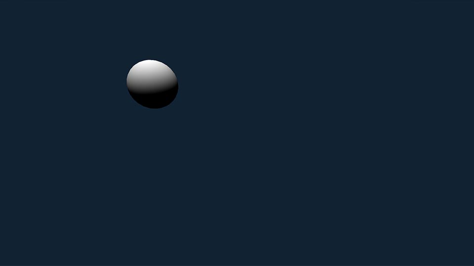

# Basic Setup

***index.html** and **index.js** go in the root of your project.*

### **index.html**

```html
<!DOCTYPE html>
<html lang="en">
  <head>
    <title>three-laser-party</title>
    <meta charset="utf-8">
    <meta name="viewport" content="width=device-width, user-scalable=no, minimum-scale=1.0, maximum-scale=1.0">
  </head>
  <body style="margin: 0">
    <script async src="https://unpkg.com/es-module-shims@1.3.6/dist/es-module-shims.js"></script>
      <script type="importmap">
        {
          "imports": {
            "three": "./node_modules/three/build/three.module.js"
          }
        }
    </script>
    <script type="module" src="./index.js"></script>
  </body>
</html>
```

### **index.js**

```js
import { OrbitControls } from './node_modules/three/examples/jsm/controls/OrbitControls.js'
import * as THREE from 'three'

var camera, scene, renderer, sphereMesh

initRendererAndCamera()
buildBasicScene()
buildLasers()
animate()

function buildLasers() {
    // Laser stuff will go here
}

function animate() {
    renderer.render( scene, camera )
    requestAnimationFrame( animate )
}

function buildBasicScene() {
    scene = new THREE.Scene()

    sphereMesh = new THREE.Mesh( 
        new THREE.SphereGeometry( 1, 64, 128 ),       
        new THREE.MeshLambertMaterial()
    )
    sphereMesh.position.set( 0, .125, 5 )
    
    scene.add( sphereMesh, new THREE.DirectionalLight() )
}

function initRendererAndCamera() {
    renderer = new THREE.WebGLRenderer()
    renderer.setClearColor( 0x112233 )
    renderer.setPixelRatio( window.devicePixelRatio )
    renderer.setSize( window.innerWidth, window.innerHeight )
    document.body.appendChild( renderer.domElement )

    const aspect = window.innerWidth / window.innerHeight
    camera = new THREE.PerspectiveCamera( 70, aspect, .1, 50 )
    camera.position.set( 3, 3, -3 )

    new OrbitControls( camera, renderer.domElement )

    window.addEventListener( 'resize', onWindowResize )
}

function onWindowResize() {
    renderer.setSize( window.innerWidth, window.innerHeight )
    camera.aspect = window.innerWidth / window.innerHeight
    camera.updateProjectionMatrix()
}
```

Nothing special going on here. It's just a sphere in a scene.

<div align="center">
    
</div>