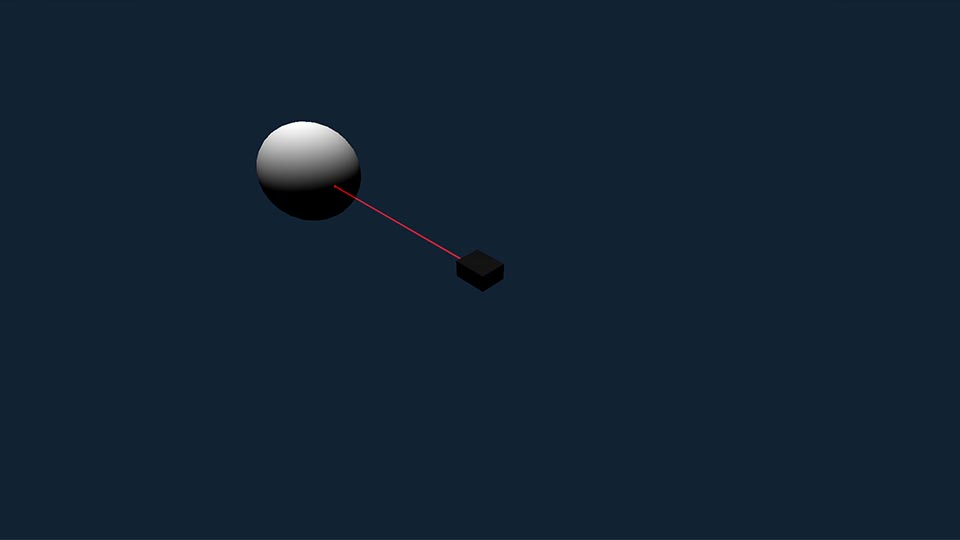
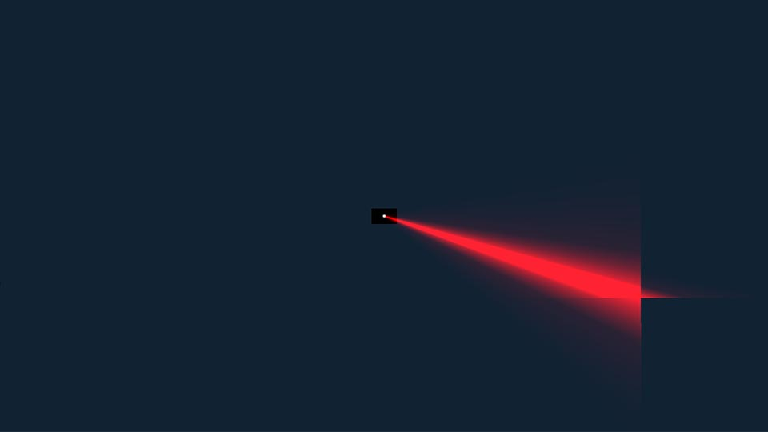
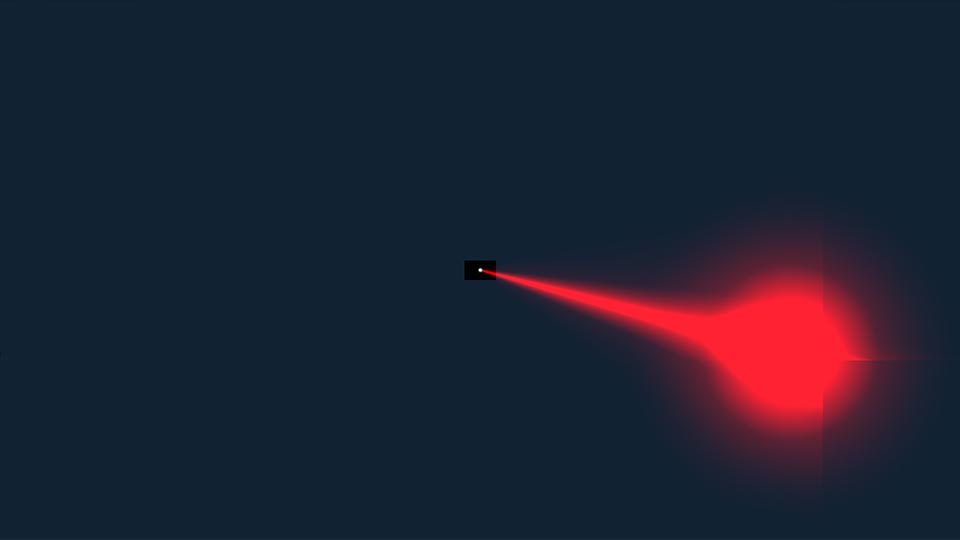
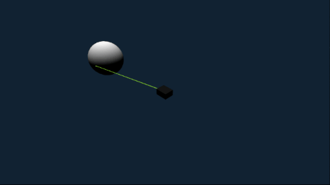
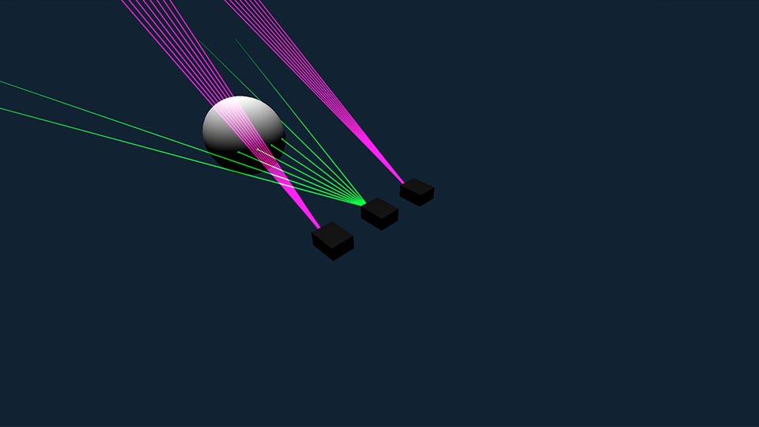
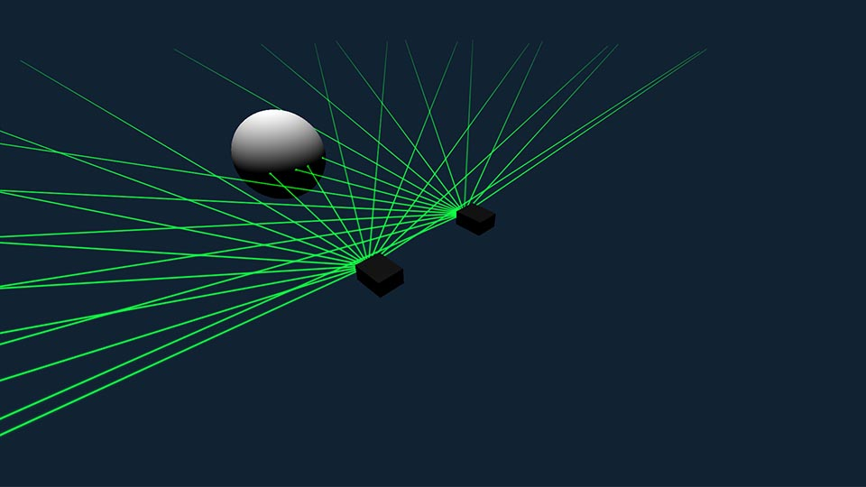
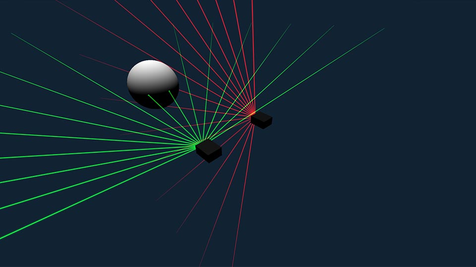

<div align="center">

  <!--  -->
# **Laser Party**
  
  <p>
    A visual laser module for THREE.js.
  </p>
  
  
<!-- Badges -->

<!-- TODO: CHANGE ALL PROJECT LINKS -->

  <p>
    <a href="https://github.com/groundbirdaircat/three-laser-party/network/members">
      
    </a>
    <a href="https://github.com/groundbirdaircat/three-laser-party/stargazers">
      
    </a>
    <a href="https://github.com/groundbirdaircat/three-laser-party/issues/">
      
    </a>
    <a href="https://github.com/groundbirdaircat/three-laser-party/blob/master/LICENSE">
      
    </a>
  </p>
   
  <h4>
      <a href="https://laserparty.glitch.me/">View Demo</a>
    <span> · </span>
      <a href="https://github.com/groundbirdaircat/three-laser-party/issues/">Report Bug</a>
    <span> · </span>
      <a href="https://github.com/groundbirdaircat/three-laser-party/issues/">Request Feature</a>
  </h4>

</div>

<br />

<!-- Table of Contents -->
# **Table of Contents**


- [**Getting Started**](#getting-started)
  * [Prerequisites](#prerequisites)
  * [Installation](#installation)
  * [Basic Setup](#basic-setup)

<br />

- [**Laser**](#laser)
  * [Importing and Creating](#importing-and-creating)
  * [Raycasting](#raycasting)
    * [Laser Specific Raycast Objects](#laser-specific-raycast-objects)
    * [Global Raycast Objects](#global-raycast-objects)
    * [Raycast Once](#raycast-once)
    * [Raycast Once with a Setting](#raycast-once-with-a-setting)
    * [Raycast Every Frame](#raycast-every-frame)
    * [Raycast Against Camera](#raycast-against-camera)
    * [Removing Raycast Objects](#removing-raycast-objects)
  * [Settings](#settings)
    * [Transforms](#transforms)
    * [General](#general)
      * [`enabled`](#enabled)
      * [`baseBox`](#basebox)
      * [`addTo`](#addto)
      * [`count`](#count)
      * [`thickness`](#thickness)
      * [`distance`](#distance)
      * [`pointAt`](#pointat)
      * [`raycast`](#raycast)
      * [`raycastOnce`](#raycastonce)
    * [Animations](#animations)
      * [`animation`](#animation)
      * [`colorAnimation`](#coloranimation)
      * [`speed`](#speed)
    * [Color](#color)
      * [`hue`](#hue)
      * [`saturation`](#saturation)
      * [`lightness`](#lightness)
    * [Movement](#movement)
      * [`side`](#side)
      * [`spread`](#spread)
      * [`spin`](#spin)
      * [`angleX`](#anglex)
      * [`angleY`](#angley)
  * [Setting Your Own Defaults](#setting-your-own-defaults)
  * [Methods](#methods)
    * [`addTo()`](#addto-method)
    * [`pointAt()`](#pointat-method)
    * [`destroy()`](#destroy-method)
    * [`apply()`](#apply-method)
    * [`reset()`](#reset-method)
    * [`resetColor()`](#resetcolor-method)
    * [`resetAnimation()`](#resetanimation-method)
    * [`updateSpreadAndSide()`](#updatespreadandside)
    * [`update()`](#update-method)
- [**Group**](#group)
  * [Adding Lasers to a Group](#adding-lasers-to-a-group)
  * [Change a Group Setting](#change-a-group-setting)
  * [Methods](#group-methods)
    * [`add()`](#group-add)
    * [`remove()`](#group-remove)
    * [`removeAll()`](#group-removeall)
- [**Pose**](#pose)
  * [Create a pose](#create-a-pose)
  * [Edit a pose](#edit-a-pose)
  * [Apply a pose](#apply-a-pose)
  * [Additional Properties](#additional-properties)
- [**Preset**](#preset)
  * [Create a Preset](#create-a-preset)
  * [Preset Configs](#preset-configs)
  * [Apply a Preset](#apply-a-preset)
  * [Preset Flow](#preset-flow)
- [**Creating Animations**](#creating-animations)
  * [Creating an Animation Object](#creating-an-animation-object)
  * [Animation Object Properties](#animation-object-properties)
  * [Destructuring Argument Properties](#destructuring-argument-properties)
  * [Animating Your Laser](#animating-your-laser)
  * [Initializing the Animation](#initializing-the-animation)
  * [Animating Color](#animating-color)
    * [Destructuring `beamParents`](#destructuring-beamparents)
  * [Advanced Technique](#advanced-technique)
- [**The `laserParty` Object**](#the-laserparty-object)
  * [`laserParty` Methods](#laserparty-methods)
  * [One Final Property](#one-final-property)
- [**Laser Hierarchy**](#laser-hierarchy)

<br />

- [Contributing](#contributing)
- [Code of Conduct](#code-of-conduct)
- [License](#license)

<br />

<!-- Getting Started -->
# **Getting Started**

<!-- Prerequisites -->
## **Prerequisites**

This guide assumes that you know the basics of JavaScript, THREE.js, and npm.

**THREE.js must be installed for three-laser-party to work.**

<br />

<!-- Installation -->
## **Installation**

Install `three` and `three-laser-party` with npm.

```
  npm i three 
  npm i three-laser-party

  # or 

  npm i three three-laser-party
```

<br />

<!--             -->
<!-- BASIC SETUP -->
<!--             -->


## **Basic Setup**

This guide will use examples based on [this basic setup](BASIC_SETUP.md).

Copy/paste if you want to follow along.

<br />


<!--       -->
<!-- LASER -->
<!--       -->


# **Laser**

## [**Importing and Creating**](#importing-and-creating)

To create a laser, we must first import the module.

Under the three.js imports, add:


```js
import laserParty from 'three-laser-party'
```

Now, in our [`buildLasers()`](#basic-setup) function, let's add a laser.

```js
function buildLasers() {

    var laser1 = laserParty.new()
    scene.add( laser1 )

}
```

<div align="center">
    
</div> 

*Technically, `laserParty.new()` returns a class.*

If you prefer to access it as a class, you can change your import to:

```js
import laserParty, { Laser } from 'three-laser-party'
```

Now you can use normal class syntax:

```js
function buildLasers() {

    var Laser1 = new Laser()
    scene.add( Laser1 )

}
```

<div align="center">
    
</div> 

Currently, our laser goes through the sphere.

Let's fix that with raycasting.

<br />


<!--         -->
<!-- RAYCAST -->
<!--         -->


## [**Raycasting**](#raycasting)

Raycasting is enabled by default, but there are a couple things we need to set up before we can actually see the effect.

First, we need to tell the raycaster which objects to raycast against. There are a couple ways to do this.

<br />

### **Laser Specific Raycast Objects**

```js
Laser1.raycast.add( sphereMesh ) 
```

Now, only `Laser1` will raycast against [`sphereMesh`](#basic-setup).

This is useful if you want to selectively raycast certain lasers against specific objects. It can also help performance by allowing you to raycast on *only what's needed* for each laser.

Since we are going to add another laser later, and we won't have a ton of objects in our scene, let's take a different approach.

<br />

<!-- To add an object globally, you can use: -->
### **Global Raycast Objects**

```js
laserParty.raycast.addGlobal( sphereMesh )
```

This enables raycasting against [`sphereMesh`](#basic-setup) for **all** lasers.

You can call this method in the [`buildBasicScene()`](#basic-setup), after the [`sphereMesh`](#basic-setup) is created. Lasers **do not** have to exist before adding [*global* raycast objects](#laserparty-raycast-addglobal).

Next, we need to tell the raycaster to do the raycast.

If your scene is static, or you only want to raycast once, you have a couple of options.

<br />

### **Raycast Once**

After creating `Laser1`, call this method:

```js
Laser1.raycast.once()
```

The sphere now stops our laser.

<div align="center">
    
</div> 

Nice. You can call `Laser1.raycast.once()` at any time to raycast specifically from `Laser1`.

If you want to raycast one time, right at the beginning, we can use a `Laser` [setting](#settings) instead.

First, remove the call to `once()`:

```diff
-   Laser1.raycast.once()
```

<br />

### **Raycast Once with a Setting**

```js
function buildLasers() {

    var Laser1 = new Laser({
        raycastOnce: true
    })

    scene.add( Laser1 )

}
```


<div align="center">
    
</div> 

This [settings object](#settings) is very useful, and is widely used throughout the party. More on this later.

To see the effect of only raycasting once, let's animate the sphere away from the laser.

Add this to the top of your [`animate()`](#basic-setup) loop:

```diff
+   sphereMesh.position.z += .01
```

<div align="center">
    
</div> 

The laser stays where it raycasted to, because we only raycasted one time.

<br />

### **Raycast Every Frame**

Add this to your [`animate()`](#basic-setup) loop:

```diff
+   laserParty.updateAll()
```

*Note:* We *could* call `Laser1.raycast.once()` in our loop instead, and get it to work for this example, but [`laserParty.updateAll()`](#laserparty-updateall) is required for animations, so let's stick with that method.

Since we are now raycasting on every frame, we can remove [`raycastOnce`](#raycastonce)`: true` from `Laser1`.

```js
function buildLasers() {

    var Laser1 = new Laser()
    scene.add( Laser1 )

}
```

<div align="center">
    
</div> 

Sweet. Now you're raycasting dynamically.

If you want to *exclude* any lasers from raycasting, you can use the setting [`raycast`](#raycast)`: false`, or you can disable raycasting directly from the laser.

```js
    var Laser1 = new Laser({
        raycast: false
    })

    // or

    Laser1.raycast.enabled = false
```

*Note:* You can use [`raycast`](#raycast)`: false` with [`raycastOnce`](#raycastonce)`: true` to raycast a laser one time, while still updating other lasers on every frame with [`laserParty.updateAll()`](#laserparty-updateall). Likewise, calling `Laser1.raycast.once()` will still work when raycasting is disabled on that laser.

<br />

## **Raycast Against Camera**

You might have noticed by now, that a laser intersecting the camera doesn't look great, and it exposes the structure of the beam's planes.

<div align="center">
    
</div> 

We can (*kind of*) fix this with raycasting.

Our camera doesn't have any geometry, so we can't raycast directly to the camera.

Instead, we can add a mesh with geometry to the camera, and then raycast against that mesh.

```js
var boxMesh = new THREE.Mesh( new THREE.BoxGeometry() )
boxMesh.scale.set( .3, .3, .2 )

camera.add( boxMesh )
```

Since we don't want to actually see the mesh, it doesn't need a material.

The `scale` of the mesh depends on your camera's FOV, and how far you want the beam to stop infront of the view. 

`( .3, .3, .2 )` seems to work fine for our [basic setup](#basic-setup).

The last thing we have to do is add the mesh as a raycasting object.

```js
laserParty.raycast.addGlobal( boxMesh )
```

<div align="center">
    
</div> 

That looks a bit better. The hard lines are also less noticeable when the laser is animating.

We could probably make this even better by using a custom shader to fade out the very end of the beam, but I am not too great with shaders yet. If you are, and you want to help, feel free to check out the [contributing](#contributing) section.

Anyway, lasers aren't supposed to be pointed into eyes, and even though this laser won't do any damage, maybe it's better to just follow general laser safety.

<br />

## **Removing Raycast Objects**

If you want to remove an object from **global** raycasting, use:

```js
laserParty.raycast.removeGlobal( object )
```

If you want to remove an object that was added to a **specific laser**'s raycasting, use:

```js
Laser1.raycast.remove( object )
```

Obviously, `Laser1` is the vabiable name we gave our laser. You can call `raycast.remove()` on any laser.

<br />

That's it for raycasting. Let's see what else we can do with our laser.

<br />

If you're following along, we don't need the sphere to animate anymore.

```diff
-   sphereMesh.position.z += .01
```

<br />


<!--          -->
<!-- SETTINGS -->
<!--          -->


## [**Settings**](#settings)

Settings can be set with a ***settings object*** that is passed when creating a laser.

```js
var Laser1 = new Laser({
    // settings go here
})

// or

var Laser1 = laserParty.new({
    // settings go here
})
```
*Notice that we are passing an object literal `{ }` to our constructor.
<br />
You can pass an object reference if you prefer that approach.*

<br />


Settings can also be changed directly on a laser, after it's created, unless specifically noted in this guide.

```js
Laser1.<setting> = <value>
```

[Transform](#transforms) settings have a different syntax *after* the laser is created. Let's talk about that first.

<br />

## **Transforms**

When using a [settings object](#settings) while creating a laser, you can use these transform properties:

```js
  // position
  x: number
  y: number
  z: number

  // rotation (radians)
  rotX: number
  rotY: number
  rotZ: number

  // overall scale
  scale: number

```

These are simply shortcuts to make laser creation neater.

Once the laser is created, you must use the usual THREE.js way of transforming objects.

```js
Laser1.position.x = 2

// etc...
```

<br />

## **General**

###### enabled
## `enabled:` `boolean`

Default: `true`

The `enabled` setting controls the visibility of the laser's beams and sprites.

Setting `enabled` will not change the visibility of the laser's [`baseBox`](#basebox).

<br />

###### baseBox
## `baseBox:` `boolean`

Default: `true`

*Note:* `baseBox` can **only** be set on laser creation with a [settings object](#settings).

The `baseBox` setting controls the box mesh that the laser comes out of.

When using `baseBox: true`, the laser object's origin is at the bottom center of the baseBox, and the laser beam starts at the front of the baseBox.

When using `baseBox: false`, the baseBox mesh will not be created, and the laser beam will start at the origin of the laser object.

<br />

###### addTo
## `addTo:` `Object3d`
Default: `null`

The `addTo` setting sets which object to add the laser to upon creation.

```js
var Laser1 = new Laser({ addTo: scene })

// is the same as

var Laser1 = new Laser()
scene.add( Laser1 )
```
*Note:* This only works as a **property** during laser creation.

After creating a laser, you can use the [`addTo()`](#addto-method) method.

```js
var Laser1 = new Laser()
Laser1.addTo( scene )
// same as above
```
<br />

###### count
## `count:` `number`

Default: `1`

The `count` setting changes how many beams your laser has.

<br />

###### thickness
## `thickness:` `number`

Default: `1`

The `thickness` setting changes how thick your laser's beams are.

Changing the `thickness` also changes the size of the beams [pointSprites](#laser-hierarchy) *(seen at the end of beams when *[raycasting](#raycast)* intersects)* and the [baseSprite](#laser-hierarchy) *(if you have [`baseBox`](#basebox) enabled)*.

<br />

###### distance
## `distance:` `number`

Default: `30`

The `distance` setting controls how long your laser's beams are, or the distance from the start of the beam, to the end.

If [raycasting](#raycast) is enabled, this will be the **max** distance of the beam, and also the **max** distance that [raycasting](#raycast) will be detected at.

<br />

###### pointAt
## `pointAt:` `Vector3` or `Object3d`

Default: `null`

This will run `lookAt()` on the [`laserWrap`](#laser-hierarchy).

This setting can only be set with a [settings object](#settings). After creation, you can use the [`pointAt()`](#pointat-method) method.

See the [`pointAt()` method](#pointat-method) for more info.

<br />

###### raycast
## `raycast:` `boolean`

Default: `true`

*Note:* This setting only works when used in a laser's [settings object](#settings). To change this setting after creating the laser, set `raycast.enabled = boolean` on your [laser](#laser) variable.

The `raycast` setting sets whether the laser should raycast or not when [`laserParty.updateAll()`](#laserparty-updateall) is called.

<br />

###### raycastOnce
## `raycastOnce:` `boolean`

Default: `false`

*Note:* This setting only works on laser creation.

On an *existing* laser, you can use the [`raycast.once()`](#raycast-once) method

If the `raycastOnce` setting is `true`, the laser will raycast one time after it is created. This setting is not needed if you are [raycasting on every frame](#raycast-every-frame).

*Note:* This setting will work, regardless of the state of the [`raycast`](#raycast) setting.

<br />

## **Animations**
We haven't covered [creating animations](#creating-animations) yet, but there are some included built in animations that will help us visualize the rest of our settings. So let's look at how we can add *existing* animations to our laser by using a [settings object](#settings).

*Note:* Animations will override laser settings. If you want to see the *static* effect of the setting, you may have to remove an animation *(**only** if that animation is using the same setting)*.

There are two types of animations, [**movement**](#animation) and [**color**](#coloranimation). First, we'll talk about [**adding movement animations**](#animation).

<br />

###### animation
## `animation:` `string` or [`movement animation object`](#creating-an-animation-object)

Default: `null`

The `animation` property sets the current **movement** animation for that laser.

To test this, add `animation: 'exampleMovement'` to the laser.

```js
var Laser1 = new Laser({
  animation: 'exampleMovement'
})

// or

var Laser1 = new Laser()
Laser1.animation = 'exampleMovement'
```

*Note:* You must have [`laserParty.updateAll()`](#laserparty-updateall) in your [`animate()`](#basic-setup) loop for animations to work.

<div align="center">
    
</div> 

Now the laser is animating movement.

<br />

###### colorAnimation
## `colorAnimation:` `string` or [`color animation object`](#animating-color)

Default: `null`

The `colorAnimation` property sets the current **color** animation for that laser.

To test this, add `colorAnimation: 'exampleColor'` to our laser.

```js
var Laser1 = new Laser({
  animation: 'exampleMovement',
  colorAnimation: 'exampleColor'
})
```

<div align="center">
    
</div> 

Now the laser is animating color and movement.

<br />

###### speed
## `speed:` `number`

Default: `1`

The `speed` property multiplies the `time` and `deltaTime` values that get passed to [animation functions](#fn-animation).


*Note:* If a [global animation speed](#laserparty-globalanimationspeed) is set, the laser's speed property will also multiply with the global speed property.

<br />

<br />

### [**Using Examples**](#using-examples)

The following properties all have built in examples. To see them, add the animation property *(at the end of the description)* **to the laser, [*as we just did.*](#animations)**

You will need the [count](#count) of your laser to be **more than one** to see ***some*** of the effects.

```js
var Laser1 = new Laser({
    count: 8
})
```

<br />

## **Color**

Laser Party uses HSL values for color. HSL stands for Hue, Saturation, and Lightness. So naturally, these are the color options.

*Note:* If you want to set the hue, saturation, or lightness of a **specific beam** in a laser, you will need to [set the property](#destructuring-beamparents) on that beam's [beamParent](#laser-hierarchy).

<br />

###### hue
## `hue:` `number`

Default: `0`

The `hue` property sets the color of **all** beams on our laser. As per usual, 0 is red, and then 360 is also red. 

The numbers in between are all of the other available colors.

The neat thing about setting `hue` is that you can go outside of the 0 - 360 range, and it will still work. So that means 720 is red, and -360 is also red.

[**Example:**](#using-examples) `colorAnimation: 'exampleHue'`

<br />

###### saturation
## `saturation:` `number`

Default: `1`

Range: `0` - `1`

The `saturation` property sets how much color is in **all** beams of a laser.

Setting `saturation` to `0` will make your laser white. Setting it to `1` makes it full color.

[**Example:**](#using-examples) `colorAnimation: 'exampleSaturation'`

<br />

###### lightness
## `lightness:` `number`

Default: `.5`

Range: `0` - `1`

The `lightness` property sets how bright **all** beams of a laser are.

Since our beams and sprites use `AdditiveBlending`, the `lightness` values work a little different than they normally would.

Setting `lightness` to `0` will make your laser's beams ***invisible***. Setting it to `1` makes them completely white. For a **full color value**, set `lightness` to `.5`.

[**Example:**](#using-examples) `colorAnimation: 'exampleLightness'`

<br />

## **Movement**

###### side
## `side:` `number`

Default: `0`

Range: `-1` - `1`

The `side` setting will set the angular direction of the laser's beams, with one added benefit. When a beam goes too far to the side, it will become invisible.

This is beneficial when the [`baseBox`](#basebox) is enabled. It stops the beams from clipping through the box.

Setting `side` to `0` will point the laser's beams forward, as it is the center point between `-1` and `1`.

The direction that side will go depends on the [`spin`](#spin) of the laser. If [`spin`](#spin) is set to `0`, and the laser is not rotated, side will move horizontally.

[**Example:**](#using-examples) `animation: 'exampleSide'`

<br />

*Note:* Setting [`spread`](#spread) and/or [`side`](#side) *after* laser creation requires a call to the laser's method [`updateSpreadAndSide()`](#updatespreadandside) after one or both changes. **This only applies** if you are **not** calling [`laserParty.updateAll()`](#laserparty-updateall) in your [`animate()`](#basic-setup) loop. In that case, it would update automatically.


<br />

###### spread
## `spread:` `number`

Default: `1`

Range: `0` - `1` *(not strict)*

The `spread` setting changes how far apart your beams are from each other. Setting this to `1` will give maximum spread, without clipping. 

Values above 1 will work, but they will begin to disable visibility for beams on the edge, similar to how [`side`](#side) works.

Setting `spread` to `0` will move all lasers on top of each other.

Negative values are basically the same as positive, except the beams will be spread to opposite sides.

*Note:* Setting `spread` when [`count`](#count) is `1` will have no effect.

[**Example:**](#using-examples) `animation: 'exampleSpread'`


<br />

###### spin
## `spin:` `number`

Default: `0`

The `spin` setting rotates the `z` axis of the [laserWrap](#laser-hierarchy), in radians.

It will not rotate the [`baseBox`](#basebox).

Setting `spin` should not cause clipping with the [`baseBox`](#basebox).

*Note:* `spin` will have no effect if [`count`](#count) is `1`, **or** [`spread`](#spread) is `0`, **and** the beam is pointing directly forward.


[**Example:**](#using-examples) `animation: 'exampleSpin'`


<br />

###### angleX
## `angleX:` `number`

Default: `0`

The `angleX` setting rotates the `x` axis of the [laserWrap](#laser-hierarchy), in radians.

*Note: Internally, this setting actually rotates `value * -1`. This is so positive numbers will angle upwards, as that seems more natural for this situation.*

Unlike [`spread`](#spread) and [`side`](#side), `angleX` has no limit. It will not turn off visibility of any lasers, and if you're using the [`baseBox`](#basebox), it can cause the beams to clip through the box. So use with caution.

The direction that `angleX` will go depends on the [`spin`](#spin) of the laser. If [`spin`](#spin) is set to `0`, and the laser is not rotated, `angleX` will rotate vertically.

[**Example:**](#using-examples) `animation: 'exampleAngleX'`

<br />

###### angleY
## `angleY:` `number`

Default: `0`

The `angleY` setting rotates the `y` axis of the [laserWrap](#laser-hierarchy), in radians.

This setting is the same as [`angleX`](#anglex) in that it will not turn off visibility of any lasers, and if you're using the [`baseBox`](#basebox), it can cause the beams to clip through the box. So use with caution.

The direction that `angleY` will go depends on the [`spin`](#spin) of the laser. If [`spin`](#spin) is set to `0`, and the laser is not rotated, `angleY` will rotate horizontally.

[**Example:**](#using-examples) `animation: 'exampleAngleY'`

<br />
<br />

That's it for [settings](#settings).

Let's check out how we can save ourselves from typing these over and over by setting defaults.

<br />


<!--          -->
<!-- DEFAULTS -->
<!--          -->


## [**Setting Your Own Defaults**](#setting-your-own-defaults)

Now that you know about the [laser settings](#settings), defaults will be easy.

For this, we will use the [`laserParty.defaults`](#laserparty-defaults) object.

You can change properties on this object, or pass it's `set()` method a [setting object](#settings).

These properties are exactly the same as the ones we went over in [laser settings](#settings), with the *exclusion* of [transform](#transforms) settings: `x`, `y`, `z`, `rotX`, `rotY`, and `rotZ`. This is because these transforms are usually different, and should probably be set explicitly. 

<!-- TODO: update link for this project -->
*Would you actually use these? Feel free to <a href="https://github.com/groundbirdaircat/three-laser-party/issues/">request a feature</a>.*

<br />

Okay, let's redo our [`buildLasers()`](#basic-setup) function:

```js
function buildLasers() {

    // set defaults
    laserParty.defaults.set({
        addTo: scene,
        count: 8,
        
        hue: 123, // green

        angleX: .5,
        spread: .05
    })
    
    // middle laser
    var Laser1 = new Laser({ 

        // laser settings override defaults
        angleX: 0,
        spread: .25
    })
    
    // change defaults
    laserParty.defaults.hue = 321 // pink
    
    // outer lasers
    var Laser2 = new Laser({ x: 1 })
    var Laser3 = new Laser({ x: -1 })
}
```

<div align="center">
    
</div> 

As you can see, **setting properties on a new laser still overrides the defaults**.

Also, any changes made to defaults are applied **only** to lasers created ***after the changes were made***.

<br />

For our final stop on [lasers](#laser), we'll check out what [methods](#methods) are available.

<br />


<!--         -->
<!-- METHODS -->
<!--         -->


## [**Methods**](#methods)

Methods are called on the [laser](#laser).

```js
Laser1.<method>()
```

`Laser` extends `Object3d`, so **you can use THREE's `Object3d` methods** as well.

<br />

## **General Methods**


###### addTo method

## `addTo(` `Object3d` `)`

The `addTo()` method is another approach to THREE's `add` method, but with the roles reversed.

```js
Laser1.addTo( scene )

// is the same as

scene.add( Laser1 )
```

<br />

###### pointAt method
## `pointAt(` `Vector3` or `Object3d` `)`

The `pointAt()` method will call `lookAt()` on the [`laserWrap`](#laser-hierarchy).

Since this changes the transforms of the [`laserWrap`](#laser-hierarchy), this method will override [`spin`](#spin), [`angleX`](#anglex), and [`angleY`](#angley).

This method will not change the transforms of the [`baseBox`](#basebox).

Just like  [`angleX`](#anglex), and [`angleY`](#angley), using `pointAt()` may cause your beams to clip with the [`baseBox`](#basebox), so use with caution.

<br />

###### destroy method

## `destroy()`

The `destroy()` method traverses the laser's [hierarchy](#laser-hierarchy), calls `dispose()` on all applicable materials, and removes the laser from its parent.

Once this is called, you cannot get that laser back.

<br />

###### apply method

## `apply(` [`pose`](#pose) `)`

The `apply()` method applies a [`pose`](#pose) on an object.

You can also call `apply()` **from the [`pose object`](#apply-a-pose)**.

<br />

## **Reset Methods**

The reset methods are useful for setting a starting point for laser settings, when changing [`poses`](#pose) or [animations](#animations).

This allows you to have consistent results, rather than combining previous settings, which is also a valid approach.

<br />

###### reset method

## `reset(` `0` `)`

The `reset()` method, when called ***without*** any arguments, will reset the [movement](#movement) settings of a laser, to whatever settings it was created with.

When `reset()` is passed a `0` as an argument, it will **zero** out the [movement](#movement) settings.

<br />

###### resetColor method

## `resetColor(` `0` `)`

The `resetColor()` method, when called ***without*** any arguments, will reset the [color](#color) settings of a laser, to whatever settings it was created with.

When `resetColor()` is passed a `0` as an argument, it will set [`hue`](#hue) to `0`, [`saturation`](#saturation) to `1`, and [`lightness`](#lightness) to `.5`, which is fully red.

<br />

###### resetAnimation method

## `resetAnimation(` `0` `)`

You guessed it:

The `resetAnimation()` method, when called ***without*** any arguments, will reset the [animations](#animations) settings of a laser, to whatever settings it was created with.

When `resetAnimation()` is passed a `0` as an argument, it will set both [`animation`](#animation) and [`colorAnimation`](#coloranimation) to `null`, and will set [`speed`](#speed) to `1`.

<br />

## **Update Methods**

These final two methods **only apply** if you are **not** calling [`laserParty.updateAll()`](#laserparty-updateall) in your [`animate()`](#basic-setup) loop.

If you are calling it, these updates will happen automatically.

<br />

###### updateSpreadAndSide

## `updateSpreadAndSide()`

The `updateSpreadAndSide()` method is pretty self explanitory. It updates the position of the laser's beams after making changes to [`spread`](#spread) and/or [`side`](#side).

[`spread`](#spread) and [`side`](#side) work together to create their effect, so it doesn't make sense to update their position until all settings have been set. 

This method is called internally by [`laserParty.updateAll()`](#laserparty-updateall).

<br />

###### update method

## `update()`

This method does two things. 

First, it calls [`updateSpreadAndSide()`](#updatespreadandside), and then, if [raycasting](#raycast) is enabled, it will call [`raycast.once()`](#raycast-once) on the laser.

Essentially, [`laserParty.updateAll()`](#laserparty-updateall) does this on every frame, for every laser.

<br />

Congrats, you made it through lasers!

<br />


<!--       -->
<!-- GROUP -->
<!--       -->


# **Group**

A `group` is **not** the same as a `THREE.Group()`, nor is it an `Object3d`.

A `group` is a regular JavaScript object with properties and methods that allow you to change *the same* [settings](#settings) on multiple [lasers](#laser) at once.

You **can** have a [laser](#laser) in multiple groups at the same time.

Most [settings](#settings) you can apply to a [laser](#laser), you can also apply to a `group`, *with the **exclusion** of [transform](#transforms) settings*.

<br />

## [**Adding Lasers to a Group**](#adding-lasers-to-a-group)

To create a group, you can call [`laserParty.group()`](#laserparty-group).

```js
function buildLasers() {

    var Laser1 = new Laser({ x: 1 })
    var group1 = laserParty.group( Laser1 )

    // you can also add lasers
    // after a group is created

    var Laser2 = new Laser({ x: -1 })
    group1.add( Laser2 )

    group1.addTo( scene )
    
}
```
`group()` accepts an unlimited amount of [lasers](#laser) and *arrays* of [lasers](#laser) as arguments.

<br />

## [**Change a Group Setting**](#)

You can set a [setting](#settings) on a `group` like you would with an *existing* [laser](#laser).

```js
group1.hue = 123
group1.count = 16
```

<div align="center">
    
</div> 

<br />

`groups` are also useful when working with [poses](#pose) and [presets](#preset).

<br />

## [**Group Methods**](#group-methods)

You can run all of the same [laser methods](#methods) on groups, and it will run that method on every laser in the group.

```js
// destroy all lasers in a group
group1.destroy()
```


For info on these methods, check [laser methods](#methods).

<br />
There are also a few other group methods:

<br />

###### group add

## `add(` [`lasers`](#laser) and/or `arrays` of [`lasers`](#laser) `)`

The `add()` method adds lasers to the `group` *after* the `group` was created.

To see it in action, check out [Adding Lasers to a Group](#adding-lasers-to-a-group).

<br />

###### group remove

## `remove(` [`lasers`](#laser) and/or `arrays` of [`lasers`](#laser) `)`

The `remove()` method functions the same as the `add()` method, except that it removes lasers from the `group`, instead of adding.

<br />

###### group removeAll

## `removeAll()`

The `removeAll()` method removes **all** lasers from a `group`.

<br />


<!--      -->
<!-- POSE -->
<!--      -->


# **Pose**

A `pose` is basically a [setting object](#settings) that can be applied to any [lasers](#laser), [groups](#group), or arrays of [lasers](#laser) and/or [groups](#group).

It accepts all [color](#color), [movement](#movement), and [animation](#animation) settings.

Poses are also used with [presets](#preset).

<br />

## [**Create a pose**](#create-a-pose)

To create a pose, use `laserParty.pose()`.

```js
var pose1 = laserParty.pose({
    spread: 0,
    hue: 123,
    animation: 'exampleSide'
    // etc...
})
```

<br />


## [**Edit a pose**](#edit-a-pose)

Once your pose is created, you can edit it with [setting](#settings) properties:

```js
pose1.spread = .5
```

To delete the setting from the pose, you can set it to `null`.

```js
pose1.spread = null
```

Poses will only apply the settings that exist on that pose.

<br />


## [**Apply a pose**](#apply-a-pose)

You can `apply()` a `pose` to many lasers at once.

```js
pose1.apply(
  group1,
  Laser3,
  arrayOfGroupsAndOrLasers
)
```

<br />


## [**Additional Properties**](#additional-properties)

There are three additional properties you can use on a `pose`.

They are `resetOnApply`, `resetColorOnApply`, and `resetAnimationOnApply`.

These can be set to `true` or `0`.

This will call the laser methods [`reset()`](#reset-method), [`resetColor()`](#resetcolor-method), and/or [`resetAnimation()`](#resetanimation-method) ***before*** applying the `pose` to the lasers.

Setting `true` or `0` works the same way as it does with the [reset methods](#reset-methods).


<br />


<!--        -->
<!-- PRESET -->
<!--        -->


# **Preset**

If you've been wondering what the purpose of groups and poses are, now is the moment you've been waiting for.

**Presets** allow you to set different [poses](#pose) on different [lasers](#laser) or [groups](#group), with a single function call.

This means we can abstract all of our different laser states down to one function, and calling this function will set all included lasers to whatever variation of settings we choose for each of them.

<br />

## [**Create a Preset**](#create-a-preset)

To create a `preset`, we can call [`laserParty.preset()`](#laserparty-preset)

`preset()` requires [configs](#preset-configs), *passed as arguments*.

```js
var preset1 = laserParty.preset(
    { 
        target: Laser1, 
        pose: pose1 
    },
    { 
        target: Laser2, 
        pose: pose2 
    }
)
```

<br />

## [**Preset Configs**](#preset-configs)

`laserParty.preset()` takes an unlimited amount of objects as arguments. 

We'll call these objects [**preset configs**](#preset-config).

<br />


These config objects use the following properties:

### `target:` [`laser`](#laser), [`group`](#group), or `array` of [`lasers`](#laser) and/or [`groups`](#group)

*Note:* `target` is **required** on every **preset config**.

<br />

***At least one** of the following properties are **also required:***
<br />


### `pose:` [`pose`](#pose)

<br />

### `animation:` [`animation object`](#creating-an-animation-object) or animation name ( `string` )

<br />


### `colorAnimation:` [`colorAnimation object`](#animating-color) or colorAnimation name ( `string` )

<br />

## [**Apply a Preset**](#apply-a-preset)

To apply a `preset`, simply call `apply()` on the preset.
```js
<preset>.apply()
```

Let's see it in action:

```js
function buildLasers() {
    
    laserParty.defaults.addTo = scene
    laserParty.defaults.count = 16

    var Laser1 = new Laser({ x: 1 })
    var Laser2 = new Laser({ x: -1 })

    var pose1 = laserParty.pose({ hue: 123 }) // green
    var pose2 = laserParty.pose({ spin: 1.57 }) // quarter rotation
    
    var preset1 = laserParty.preset(
        {
            target: Laser1,
            pose: pose1
        },
        {
            target: Laser2,
            pose: pose2
        }
    )

    preset1.apply()
}
```

<div align="center">
    
</div> 

The nice part about this, is we can now build up multiple presets, and easily change between them with their `apply()` method.

<br />


## [**Preset Flow**](#preset-flow)

[**Preset configs**](#preset-config) are applied in the order they are received.

If multiple [**preset configs**](#preset-config) target the same laser, with the same properties, the **later** [**config's**](#preset-config) settings will override the *earlier settings*.

```js
var pose3 = laserParty.pose({ spin: 0 })

var preset1 = laserParty.preset(
    {
        target: Laser1,
        pose: pose2, // quarter rotation
    },
    {
        target: Laser1, // same target
        pose: pose3, // 0 rotation
    },
)

preset1.apply()

// pose3 will override pose2
// Laser1 'spin' will be set to 0

```

If you have a [`pose`](#pose) **and** an `animation` and/or `colorAnimation` in your [**preset config**](#preset-config), the [`pose`](#pose) will be applied first, *and then* the animations will run.

```js
var preset1 = laserParty.preset(
    {
        target: Laser1,
        pose: pose2,
        animation: 'exampleSpin'
    }
)

preset1.apply()

// pose2 applies,
// then animation runs
```

This means that if your [`pose`](#pose) has an `animation`, **and** you use that [`pose`](#pose) along with an `animation` setting ***in the [preset config](#preset-config)***, then the [pose's](#pose) `animation` will be **overridden**.

```js
var pose1 = laserParty.pose({
  hue: 123,
  animation: 'exampleSpin'
})

var preset1 = laserParty.preset(
    {
        target: Laser1,
        pose: pose1,
        animation: 'exampleAngleX'
    }
)

preset1.apply()

// hue will change

// 'exampleSpin' will be overridden
// 'exampleAngleX' will be used
```

And that's all there is to [presets](#preset).

<br />


<!--                     -->
<!-- CREATING ANIMATIONS -->
<!--                     -->


# **Creating Animations**

We have already talked about how to add *existing* animations [here](#animation).

Animations can also be used with [groups](#group), [poses](#pose), and [presets](#preset).

Now let's talk about how to [create your own animations](#creating-an-animation-object).

Creating an animation can be fairly simple, or somewhat complex, depending on what you are trying to achieve. 

As a reminder, [`laserParty.updateAll()`](#laserparty-updateall) must be in your [`animate()`](#basic-setup) loop for animations to work.

<br />

*Note: It is important to know that **animation functions get run on every frame**, **for every laser they are set on**, so the lighter you keep these animations, the better performance you will get.*

<br />

## [**Creating an Animation Object**](#creating-an-animation-object)

To create an animation, you can use:

```js
laserParty.anim()
```

`anim()` accepts one object as an argument, which contains either two or three properties.

```js
var anim1 = laserParty.anim({
    name: 'animation1',
    type: 'movement',
    fn() {
        // animation stuff goes here
    }
})
```

This would create an [animation](#animation) object.

A [colorAnimation](#coloranimation) object is created in the same way *except* that the `type` would be changed to `'color'`.

The object you pass to `anim()` can have three properties: `name`, `type`, and `fn`.

Let's go over those.

<br />

## **[Animation Object Properties](#animation-object-properties)**

###### name animation

## `name:` `string` (optional)

The `name` property allows you to access your animation with a string that you specify, rather than the object reference. Internally both approaches work the same.

If you use names, you must use a **unique** `name` for each *named* animation.

<br />

###### type animation

## `type:` `string`

This property is **required** on every animation object.

It can only be set to `'movement'` or `'color'`.

This property specifies what `type` of animation you are creating.

<br />

###### fn animation

## `fn:` `function`

This property is **required** on every animation object.

This `function` gets called on every frame, for every laser that the animation is set on.

It gets passed an object as an argument, which you can destructure as needed.

The **available properties to destructure** are:

- `time:` `number`
  - The amount of time, in seconds, that has passed since the **first** call to [`laserParty.updateAll()`](#laserparty-updateall).

  <br />

- `deltaTime:` `number`
  - The amount of time, in seconds, that has passed since the **previous** call to [`laserParty.updateAll()`](#laserparty-updateall).

  <br />

- `init:` `boolean`
  - This will be `true` on the first frame after switching animations. For all following frames on that animation, `init` will be `false`, until the animation is changed again.

<br />

*One last piece of information before we dive in:*

### **The `this` property can be used in the function, and will be set to whatever [laser](#laser) it is currently animating.** 

`this` is very useful.

<br />

## **[Destructuring Argument Properties](#destructuring-argument-properties)**

As mentioned in [the function property](#fn-animation), you can destructure `time`, `deltaTime`, and `init` from the function's internally passed argument.

Let's check out how that would look when creating an *unnamed* **movement** animation:

```js
var anim1 = laserParty.anim({
    type: 'movement',
    fn( { time, deltaTime, init } ) {
        // animation stuff
    }
})
```

You can destructure only the properties that you need:

```js
var anim1 = laserParty.anim({
    type: 'movement',
    fn( { init } ) {
        // animation stuff
    }
})
```
<br />

## **[Animating Your Laser](#animating-your-laser)**

It's now time to make an animation function.

Let's remake our [`buildLasers()`](#basic-setup) function, and then go from there.

```js
function buildLasers() {

    // create animation
    var anim1 = laserParty.anim({
        type: 'movement',
        fn() {

        }
    })

    // create laser
    var Laser1 = new Laser({ 
        addTo: scene,
        count: 8,

        // add animation to laser
        animation: anim1
    })

}
```

*Note: You must have [`laserParty.updateAll()`](#laserparty-updateall) in your [`animate()`](#basic-setup) loop for animations to work.*

<br />

Since we are now just talking about the [animation function](#fn-animation), **the following examples will only include the `fn(){}` part**.

*It should be known that this `function` must be placed in an [animation object](#creating-an-animation-object) to work.*

<br />


```js
fn() {
    this.spin += .01
}
```

Now we are spinning.

Since this is just adding `.01` to the spin on every frame, the speed of this spin may vary depending on the refresh rate of your monitor.

To keep the speed consistent, we can use the destructured `deltaTime` property.


```js
fn( { deltaTime } ) {
    this.spin += deltaTime
}
```

Or in this case, `time` could have worked as well.

```js
fn( { time } ) {
    this.spin = time
}
```

Where `time` really shines, is when used with JavaScript's built in `Math` methods.

Specifically, `Math.sin()` and `Math.cos()` work very well.

If you aren't familiar with these methods, it may be beneficial to understand the basics of what they have to offer.

Also, other `Math` methods can be useful here as well, but that's beyond what is covered in this guide.

<br />

Let's look at `Math.sin()`

```js
fn( { time } ) {
    this.spin = Math.sin( time )
}
```

Now the laser's beams are spinning back and forth.

`Math.sin()` returns a number between `-1` and `1`.

That means our laser's beams are rotating back and forth between `-1` radian to `1` radian.

If we want our beams to **spin more times**, we can simply multiply the returned value.

```js
fn( { time } ) {
    this.spin = Math.sin( time ) * 5
}
```

Likewise, we can change the **speed** of the spin by altering the number that we pass ***into*** `Math.sin()`.

```js
fn( { time } ) {
    this.spin = Math.sin( time * .25 )
}
```

As you can see, these animation functions are where you get to be creative.

Movement animations are for animating [movement settings](#movement), and you can animate as many as you'd like at a time.

```js
fn( { time } ) {
    this.spin = Math.sin( time )
    this.side = Math.sin( time )
    this.spread = Math.cos( time )
}
```
<div align="center">
    
</div> 

Neat.

<br />

Let's talk about when you would want to destructure the `init` property.

<br />

## **[Initializing the Animation](#initializing-the-animation)**

Sometimes, you want your animation to start with a certain state.

We already know that you can call the [reset methods](#reset-methods) on a [laser](#laser), and that you can use the [additional properties](#additional-properties) on a [pose](#pose) to reset when applying the pose.

Also, using a [preset](#preset) with an [animation](#create-an-animation-object) and a [pose](#pose) will set the pose, and then run the animation, so this is valid as well.

<br />

But what if you want your animation to start at a specific state, different from what the [resets](#reset-methods) have to offer *(creation state, or zeroed state)*, and regardless of how your [poses](#pose) or [presets](#preset) are set up?

That's what our destructured `init` property is for.

<br />

As described in the [`fn` property](#fn-animation), `init` is a `boolean` value that will only be `true` on the **first** frame of an animation.

That means we can use `init` like this:

```js
fn( { init, deltaTime } ) {

    if ( init ) {
        this.spin = 1.57 // quarter rotation
    }

    this.spin += deltaTime
}
```

Now this animation will always start our laser beams with a quarter rotation applied, and then they will spin from there. This will be the case ***every time we switch*** to this animation.

<br />

## **[Animating Color](#animating-color)**

You can animate color the same way that you [animate movement](#animating-your-laser), with a few minor changes.

First of all, you'll want to change your animation [type](#type-animation) to `'color'`.

```js
var anim1 = laserParty.anim({
    type: 'color',
    fn() {

    }
})
```

Switch animation types in your laser as well:

```diff
-   animation: anim1
+   colorAnimation: anim1
```


The last change is that we now update [color](#color) settings.

```js
fn( { time } ) {
    this.hue = time * 10
}
```

Notice we are multiplying `time` to shift color *faster*.

This is nice, but what if we want to animate different colors on **different beams** of a *single* laser?

<br />

### **Destructuring [`beamParents`](#laser-hierarchy)**

To change the color of a specific beam, you want to set the [color](#color) properties on the beam's [`beamParent`](#laser-hierarchy). This will change the value for [both beam `planes`](#laser-hierarchy) and the [`pointSprite`](#laser-hierarchy) for that specific beam.

There is an easy way to iterate over `beamParents`.

Our [laser](#laser) has a ***getter*** called `getBeamParents`. It returns an `array` that *contains* an `array` for each beam. The first value of the ***nested*** `array` is that beam's index. The second value of the ***nested*** `array` is the `beamParent`.

*Remember that we access our [laser](#laser) by using `this`.*

Let's look at how we can iterate over `beamParents`:
```js
fn( { time } ) {

    for ( let [ index, beamParent ] of this.getBeamParents ) {

        if ( index % 2 === 1 ) beamParent.hue = time * 10
        else beamParent.hue = time * 10 * -1
    }
}
```
Now beams should cycle hues in opposite directions of their neighboring beams.

And, of course, *if you prefer*, we could shorten this to:

```js
fn( { time } ) {

    for ( let [ i, bP ] of this.getBeamParents ) {

        if ( i % 2 ) bP.hue = time * 10
        else bP.hue = time * -10
    }
}
```

*Note: Keep in mind that we are now iterating over **every beam** of **every laser** that is using this animation.. on **every frame**. For a small function like this, it should be fine, but it can easily become expensive, so use with caution.*


<br />

It is important to know that setting [color settings](#color) directly on a [laser](#laser) will override the color settings set on specific beams. If you want to use both [laser](#laser) and `beamParent` color properties in the same animation, set the [laser](#laser) properties first, and then set the `beamParent` properties afterwards.

<br />

## **[Advanced Technique](#advanced-technique)**

This section is easily the most *esoteric* part of the party, especially if you're new to JavaScript.

This is because we are going to use **closure** and **IIFEs** (Immediately Invoked Function Expressions) to create *private variables* for our animation functions.

These variables will stick around even after the animation function runs. 

***By no means do you have to use this technique*** to make cool animations,  but doing so definitely opens up more possibilities for what you can accomplish with your animation functions.

First, let's re-create our animation **with the *advanced*** setup:

```js
var anim1 = laserParty.anim({
    type: 'color',
    fn: (function IIFE() {

        return function() {
          
        }
      
    })()
})
```

There are a few things to notice here.

We can no longer use the shortcut `fn()` to add our function, we have to have a named property `fn:`. The value of that property ends up becoming whatever gets returned from our **IIFE** *(in this case, it is another `function`)*.

The **IIFE** comes from the parenthesis `( )` around the ***outer*** function, along with the following `()`, which causes that function to run immediately.

Since the *outer* function `return`s ***another*** function, the value of the `fn:` property of our animation object becomes the ***inner*** function.

<br />

Let's add a variable:

```js
var anim1 = laserParty.anim({
    type: 'color',
    fn: (() => {

        var currentHue = 0
        
        return function() {

        }

    })()
})
```

Notice that the variable goes in the scope of our ***outer*** function. This is how we use **closure** to keep our variable alive.

Also, notice that we can change the ***outer*** (**IIFE**) function to an **arrow function**, *if you prefer*.

This is valid, however, we can not do that for the ***inner*** function. Using an arrow function **rebinds** the `this` argument. Since the ***inner*** function specifically relies on `this` being a [laser](#laser) (which is bound internally), **we can't use an arrow function here**.

<br />

Now, let's make our function do something:

```js
var anim1 = laserParty.anim({
    type: 'color',
    fn: (() => {

        var currentHue = 0
        
        return function( { deltaTime } ) {

            currentHue += deltaTime * 10
            this.hue = currentHue
        }
    })()
})
```

You might be wondering, what's the difference between this technique, and just adding `deltaTime` to `this.hue`, similar to what we did in previous examples.

Well, with this approach, the animation will keep track of what hue it used last. If you swap animations, and then switch back, this animation will now start with whatever color it left off with.

***We couldn't easily do that before.***

If you're really thinking deep, you may realize that this function will operate differently depending on how many lasers it is set on.

This is because the function is run for **every laser** it is set to, on **every frame**. So having more lasers means our `currentHue` value gets increased multiple times per frame, thus causing the color to shift faster with the more lasers the animation is running on.

<br />

Since our function is getting called **multiple times on the same frame**, the destructured `time` property will be the **same value** for *each function call **in a specific frame***.

We can use that to check if we should update our `currentHue` variable or not.

Let's use another variable: `currentTime`.

```js
var anim1 = laserParty.anim({
    type: 'color',
    fn: (() => {

        var currentHue = 0
        var currentTime = 0
        
        return function( { time, deltaTime } ) {

            if ( time != currentTime ) {

                currentTime = time
                currentHue += deltaTime * 10
            }

            this.hue = currentHue
        }
    })()
})
```


Now our animation will run at the same speed, no matter how many lasers are using it, **and** it will keep track of the last used `hue` when switching animations. Cool.

<br />

This example was simple, but it should *somewhat* express the capabilities of keeping private variables for your animation functions.

Have fun, and get creative!

<br />


<!--                    -->
<!-- LASER PARTY OBJECT -->
<!--                    -->


# **The `laserParty` Object**

The `laserParty` object is the object that you import at the beginning of your code.

```js
import laserParty from 'three-laser-party'
```

Technically, you can name this anything, as it is a default export.

Most of the contents of this object have already been explained in this guide, so this is more of a quick reference section.

<br />

## [**`laserParty` Methods**](#laserparty-methods)

###### laserParty new

## `new(` [settings `object`](#settings) `)`

This method is an alias for `new Laser()`.

Creates a new [laser](#laser).

See [Importing and Creating](#importing-and-creating) for use.

<br />

###### laserParty raycast addGlobal

## `raycast.addGlobal(` `Object3ds` and/or `arrays` of `Object3ds` `)`

Adds `THREE.Object3d` objects to the global pool of objects for all [`raycast` enabled](#raycast) lasers to raycast against.

See [Global Raycast Objects](#global-raycast-objects) for use.

<br />

###### laserParty raycast removeGlobal

## `raycast.removeGlobal(` `Object3ds` and/or `arrays` of `Object3ds` `)`

Removes `THREE.Object3d` objects from the global pool of objects for all [`raycast` enabled](#raycast) lasers to raycast against.

See [Removing Raycast Objects](#removing-raycast-objects) for use.

<br />

###### laserParty defaults

## `defaults.set(` [settings `object`](#settings) `)`

Sets the default settings for laser creation.

You can also set the properties individually on the `default` object.

See [Setting Your Own Defaults](#setting-your-own-defaults) for use.

<br />

###### laserParty group

## `group(` [`lasers`](#laser) and/or `arrays` of [`lasers`](#laser) `)`

Allows you to set [settings](#settings) on multiple lasers at once.

See [Group](#group) for use.

<br />

###### laserParty pose

## `pose(` [settings `object`](#settings) `)`

Allows you to apply a [settings object](#settings) on existing lasers.

See [Pose](#pose) for use.

<br />

###### laserParty preset

## `preset(` [configs `object`](#preset-configs) `)`

Used to set various settings on different sets of lasers with one function.

See [Preset](#preset) for use.

<br />

###### laserParty anim

## `anim(` [`object`](#creating-an-animation-object) `)`

Creates an animation that you can run on your laser.

See [Creating an Animation Object](#creating-an-animation-object) for use.

<br />

###### laserParty updateAll

## `updateAll()`

`laserParty.updateAll()` has been mentioned a few times, because it is required for animations.

It does a few other things too. It manages the clock, and passes the [values](#destructuring-argument-properties) to animation functions. It multiplies [global](#laserparty-globalanimationspeed) and [local speed](#speed) for laser animations. It checks if an animation has [recenetly been changed](#initializing-the-animation). It calls [`updateSpreadAndSide()`](#updatespreadandside), and then finally, it tells all applicable lasers to [raycast](#raycast-once).

<br />

## [**One Final Property**](#one-final-property)

###### laserParty globalAnimationSpeed

## `globalAnimationSpeed =` `number`

Sets the global animation speed for all lasers. This multiplies the `time` and `deltaTime` values that are sent to laser animations.


<br />

<br />

### And that's it. 

The final stop of this guide will talk about laser hierarchy. This is just in case you are curious, or you want to dive in and do something custom. 

*Otherwise*, **you are ready to party**.

<br />

<br />


<!--                 -->
<!-- LASER HIERARCHY -->
<!--                 -->


# Laser Hierarchy

- Laser (extended Object3d)

  - baseBox (Mesh)
  - laserWrap (Object3d)

    - baseSprite (Sprite)
    - beamParents (Object3d * [`count`](#count))

      - pointSprite (Sprite)
      - planeParent (Object3d)

        - planes (Plane * 2)

<br />

So, the `Laser` is an `Object3d` with no geometry, and it has extra [properties](#settings)/[methods](#methods). It holds the `baseBox`, and a wrapper `Object3d`. 

This wrapper holds one sprite, the `baseSprite`, and all of the `beamParents`, one for each beam, determined by the [`count`](#count) setting. 

`beamParents` have three additional properties: `hue`, `saturation`, and `lightness`. These are used for [setting color on a specific beam](#destructuring-beamparents) of a laser.

Each of these `beamParents` hold a `pointSprite`, which is the sprite you see when raycasting intersects. The `beamParents` also hold another wrapper `Object3d`.

This final wrapper holds the two `planes` that make up the beam.

<br />

The `laserWrap` and `beamParents` get rotated by [movement settings](#movement).

The `laserWrap` visibility property gets set by [`enabled`](#enabled).

The `planeParent` gets stretched with [distance](#distance), and with [raycast](#raycast-once) intersections.

The `pointSprite`'s location gets updated to keep it at the end of the beam. It's visibility also gets turned on and off depending on whether the [raycast](#raycast-once) detected any intersections.

<br />

The textures for planes and sprites are created internally with gradients on `canvas` elements. With a little effort, you could swap the textures out for a better aesthetic.

<br />

<br />

Enjoy!

<br />


<!--     -->
<!-- END -->
<!--     -->


# Contributing

<a href="https://github.com/groundbirdaircat/three-laser-party/graphs/contributors">
  
</a>

<br />


Contributions are welcome!

Please read the [Code of Conduct](CODE_OF_CONDUCT.md) first.

<br />

<!-- Code of Conduct -->
## [Code of Conduct](CODE_OF_CONDUCT.md)

The Code of Conduct can be found [here](CODE_OF_CONDUCT.md).

<br />

<!-- License -->
## License

Distributed under the MIT License. See [LICENSE.txt](LICENSE.txt) for more information.

<br />

Project Link: [https://github.com/groundbirdaircat/three-laser-party](https://github.com/groundbirdaircat/three-laser-party)